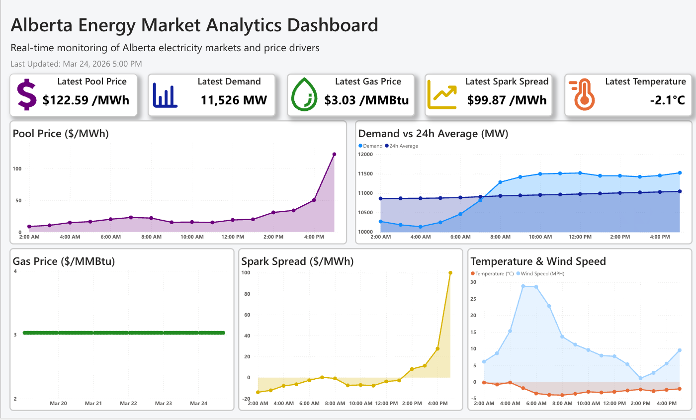

# Alberta Energy Market Analytics Dashboard

## Dashboard Preview 🖥️

## Download Dashboard ⬇️

[Power BI File (.pbix)](https://github.com/a338wong/alberta_energy_market_analytics_dashboard/raw/main/reports/alberta_energy_market_dashboard.pbix)

*The dashboard is provided as a `.pbix` file for full functionality in Power BI Desktop (Windows only).  
It can also be uploaded to Power BI Service (web) using a work or school account, though data refresh may require additional configuration.*

## Project Overview 📊

This project is an end-to-end energy market analytics platform that analyzes electricity price volatility in Alberta by integrating key market drivers, including electricity demand, natural gas prices, and weather conditions.

It tracks how electricity prices respond to changes in these variables through an automated data pipeline that handles data collection, transformation, and reporting, simulating a real-world analytics workflow used in energy trading, market analysis, and risk management.

The dashboard enables users to explore relationships between these drivers, identify patterns in price volatility, and better understand underlying market dynamics.

## Key Questions the Dashboard Answers ❓

### What drives electricity price volatility in Alberta?
- Analyze price spikes and volatility patterns  
- Examine price distributions over time  

### When does electricity demand peak?
- Identify hourly demand trends  
- Compare weekday vs weekend demand  
- Analyze seasonal demand patterns  

### How does weather influence energy demand?
- Compare temperature vs electricity demand  
- Evaluate seasonal weather effects  

### How are natural gas prices related to electricity prices?
- Analyze the correlation between gas and power prices  
- Track gas price trends alongside electricity price movements  
- Understand spark spread dynamics  

## Data Pipeline and Methodology ⚙️

### Data Collection
- AESO → Alberta pool price and demand  
- FRED API → Natural gas prices  
- Weather API → Temperature and wind speed  

### Data Processing
- Standardized timestamps across datasets (hourly alignment)
- Handled missing values and data gaps
- Joined datasets into a unified time-series table for analysis

### Feature Engineering
- Spark spread calculation (electricity price – natural gas cost proxy)
- Time-based features (hour of day, weekday/weekend, seasonality)
- Aggregated KPIs for demand, price, and volatility analysis 

### Automation
- Scheduled data pipeline using GitHub Actions (hourly refresh)
- Automated ingestion, transformation, and dataset rebuild
- Ensures dashboard reflects near real-time market conditions

### Visualization
- Power BI dashboard with KPI cards and time-series analysis  

## Tech Stack 🧰

- Python (Pandas, Requests) for data ingestion and transformation
- GitHub Actions for automated data pipeline scheduling (hourly refresh)
- Power BI for interactive dashboard visualization
- External APIs:
  - AESO (electricity market data)
  - FRED (natural gas prices)
  - Weather API (temperature, wind)
- Time-series data modeling and feature engineering (spark spread, aggregations)

## Limitations ⚠️

### Data Availability and Timeliness
- Natural gas price data sourced from FRED is subject to reporting lag and is not consistently updated on a daily basis, which may result in slight misalignment with real-time electricity market conditions  
- Data freshness across sources varies, leading to potential discrepancies in the most recent observations  

### Data Granularity and Alignment
- Differences in data frequency (e.g., hourly electricity demand vs daily natural gas prices) require resampling and forward-filling, which may introduce approximation error  
- Temporal alignment across datasets may smooth short-term fluctuations, particularly in gas price movements  

### Pipeline and Automation Constraints
- GitHub Actions operates on a scheduled basis (hourly), which may introduce delays between data availability and dashboard updates  
- Pipeline reliability is dependent on successful workflow execution and external API responsiveness  

### External Dependencies
- The system relies on third-party APIs (AESO, FRED, Weather), which may experience downtime, rate limits, or structural changes that could impact data ingestion  

### Power BI Deployment Constraints
- Due to limitations of Power BI free-tier and school-managed accounts, the dashboard cannot be publicly hosted via Power BI Service  
- As a result, users must download and open the `.pbix` file locally or upload it to Power BI Service using a compatible account  
- Automated data refresh in the cloud environment may require additional configuration (e.g., gateway setup or premium workspace)

## Future Improvements 🚀

### Data Enhancements
- Integrate higher-frequency and more timely natural gas data sources (e.g., intraday or market-based pricing) to improve alignment with electricity market movements  
- Incorporate additional market variables such as load forecasts, generation mix, and intertie flows to better capture supply-demand dynamics  

### Advanced Analytics and Modeling
- Develop forecasting models for electricity prices and demand (e.g., regression-based or machine learning approaches) to support forward-looking analysis  
- Implement volatility modeling and rolling correlation analysis to better quantify price risk and relationships between market drivers  
- Introduce lag analysis to identify delayed effects of gas prices and weather on electricity prices  

### Market Structure Analysis
- Incorporate grid congestion and transmission constraint data to analyze structural drivers of price spikes  
- Analyze supply-side factors such as generation outages and capacity constraints  

### System and Pipeline Improvements
- Enhance pipeline robustness with monitoring, logging, and failure handling for more reliable data ingestion  
- Reduce data latency by increasing refresh frequency or integrating streaming data sources  

### User Experience and Decision Support
- Build alerting mechanisms for significant market events (e.g., price spikes, demand surges)  
- Add scenario analysis and interactive filters to simulate market conditions  
- Expand dashboard interactivity with drill-down capabilities and dynamic comparisons  

## Credits 👤

- Alan Wong  
  - GitHub: https://github.com/a338wong  
  - LinkedIn: https://www.linkedin.com/in/a338wong/  
